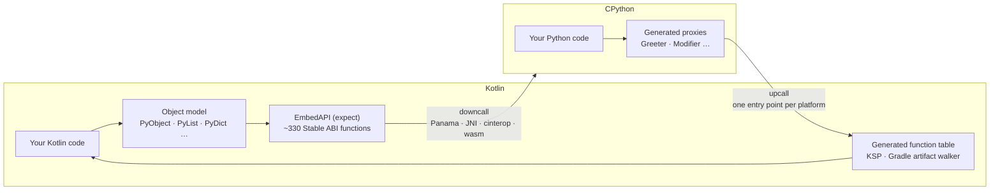

English | [한국어](docs/locale/README_ko.md)

<div align="center">

# 🐍 python-multiplatform

**Real CPython inside Kotlin Multiplatform — Kotlin calls Python, Python calls Kotlin, on every target.**

[](LICENSE)
[](https://kotlinlang.org/docs/multiplatform.html)
[](https://www.python.org/)
[-lightgrey.svg)](#-platforms)

[Guide](https://thisisthepy.github.io/python-multiplatform/) ·
[Design notes](docs/design/) ·
[Roadmap](docs/roadmap/ROADMAP.md)

</div>

---

## 💡 Why

Python has the libraries; Kotlin Multiplatform has the reach — desktop, Android, iOS, the web.
python-multiplatform puts **the real CPython interpreter** inside a Kotlin Multiplatform app and
builds a two-way bridge across it:

- Kotlin gets a **typed, Kotlin-idiomatic object model** over Python: a `PyList` *is* a `MutableList`,
  a `PyDict` *is* a `MutableMap`, a Python error *is* a `Throwable`.
- Python gets **Kotlin classes as ordinary Python**: `Greeter('Kotlin').greet(2)`, `await` on a
  `suspend fun`, Kotlin extension functions as methods — all through a table generated at build time,
  so it works where reflection does not: Kotlin/Native and GraalVM native images.

It is CPython itself, not a re-implementation, so C extensions keep working.

## ✨ Features

- 🔌 **Downcalls** — the CPython Stable ABI (~330 functions) as one `expect` surface with an `actual`
  per platform: Panama `invokeExact` on desktop, `RegisterNatives` JNI on Android, cinterop on Native.
- 🧩 **Object model** — `PyObject`, `PyType`, `PyException`, basic types, `PyList` / `PyDict` /
  `PySet` / `PyTuple` implementing Kotlin collection interfaces, modules, callables, conversion.
- 🚀 **Upcalls** — a KSP processor generates a function table; Python constructs Kotlin classes, calls
  methods, reads and writes properties, and `await`s `suspend` functions with cancellation.
- 📦 **Bind prebuilt libraries** — the Gradle plugin walks jars (Compose included) and generates the
  bindings and `.pyi` stubs, with default-argument omission and value-class support.
- ♻️ **No manual memory management** — wrappers release their Python reference when collected; reference
  cycles that cross the boundary are collected by Python's cyclic GC.
- 🧪 **Measured** — every boundary mechanism ships with overhead tests; the cost table is rendered from
  real runs ([cost table](docs/investigations/cost-table.md)).

## 🚀 Quick start

> **Not published yet.** No release is on Maven Central or JitPack today. Build from source (below);
> coordinates will be announced when a release exists.

```bash
git clone https://github.com/thisisthepy/python-multiplatform
cd python-multiplatform
./gradlew :sample:run          # desktop demo app
```

### Kotlin → Python

```kotlin
import python.multiplatform.ffi.PyObject
import python.multiplatform.ffi.Python3
import python.multiplatform.ffi.types.basic.PyInt
import python.multiplatform.ffi.types.collections.PyList

fun main() {
    Python3.initialize()

    // A real Python list of real Python ints, published into __main__.
    val numbers = PyList.fromList(listOf(2L, 3L, 5L, 7L, 11L).map { PyInt.from(it) })
    Python3.import("__main__").setAttr("kotlin_numbers", numbers)

    val globals = Python3.import("__main__").dict
    val result: PyObject = Python3.eval("sum(kotlin_numbers) * 2", 258 /* Py_eval_input */, globals, globals)
    println("${result.Type.name}: $result")   // int: 56

    Python3.exec("print('hello from python')")
    // No close() anywhere: each wrapper releases its reference when it is collected.
}
```

### Python → Kotlin

Any `public` Kotlin declaration is exposed (opt out with `@PythonInternal`):

```kotlin
package org.thisisthepy.python.multiplatform.demo.bindings

class Greeter(subject: String) {
    var subject: String = subject
    var greetings: Long = 0
        private set

    fun greet(times: Long): String { /* ... */ }
    suspend fun greetNow(times: Long): String = greet(times)
}
```

```python
from org.thisisthepy.python.multiplatform.demo.bindings import Greeter

g = Greeter('Kotlin')    # constructs the Kotlin object
g.greet(2)               # calls the Kotlin method
g.subject = 'Python'     # property setter
g.greetings = 99         # AttributeError: the Kotlin setter is private

async def main():
    return await g.greetNow(1)   # a Kotlin suspend fun, awaited
```

Both snippets come from the [`sample/`](sample/) app. The Kotlin package name is the Python module
name, unchanged.

### Platform setup

<details>
<summary><b>Desktop</b> — apply the Gradle plugin so <code>PYTHONHOME</code> has a stdlib</summary>

```kotlin
plugins {
    kotlin("jvm")
    application
    id("io.github.thisisthepy.python.multiplatform.bindings") version "<version>"
}
```

`stagePythonHome` downloads the matching CPython build, verifies it against the release's
`SHA256SUMS`, caches it machine-wide and sets `PYTHONHOME` on `run` and `test`. A `PYTHONHOME` you set
yourself is never touched; disable staging with `pythonBindings { stagePythonHome.set(false) }`.
A Compose Desktop app packaged with `createDistributable` (or a `package*` task) carries the staged
stdlib and `libpython` in its resources and starts without `PYTHONHOME`
(`pythonBindings { packagePythonHome.set(false) }` turns that off); any other packaging can name its
prefix with `-Dpython.multiplatform.home=...`. See `docs/platforms/desktop-packaged-app.md`.
</details>

<details>
<summary><b>Android</b> — call <code>PythonBootstrap.initialize</code></summary>

```kotlin
import python.multiplatform.env.PythonBootstrap

class MainActivity : ComponentActivity() {
    override fun onCreate(savedInstanceState: Bundle?) {
        super.onCreate(savedInstanceState)
        PythonBootstrap.initialize(this)   // unpacks the stdlib once, then starts CPython
    }
}
```

The stdlib ships in the APK and is unpacked to app-private storage on first launch
(measured 237–480 ms on API 26–36), then skipped by a stamp check (4–28 ms). Idempotent.
</details>

## 🧭 Architecture at a glance



Behind each platform's single entry point, **every platform uses the same generated table** — there is
no per-platform Python → Kotlin binding code. Details: [design notes](docs/design/).

## 🌍 Platforms

| Platform | Downcall | Upcall | Status |
|---|---|---|---|
| Desktop JVM (macOS) | Panama FFM | FFM upcall stub | ✅ full suite, GraalVM native image verified |
| Desktop JVM (Linux, Windows) | Panama FFM | FFM upcall stub | 🟡 wired, never run |
| Android | JNI (`RegisterNatives`) | JNI | ✅ device-tested |
| iOS | cinterop | `@CName` | 🟡 shared suite on simulator |
| Android native | cinterop | `@CName` | 🟡 shared suite on device |
| wasmJs (browser, Node) | Emscripten CPython | `@WasmExport` | 🧪 experimental |

## 📊 Status

Honest summary — see the [roadmap](docs/roadmap/ROADMAP.md) for what is left to do.

| Area | State |
|---|---|
| Interpreter lifecycle, object model, downcall surface | ✅ implemented |
| Object lifetime and cross-boundary cycle collection | ✅ desktop · 🟡 other targets |
| Upcalls (classes, properties, `suspend`, cancellation) | ✅ desktop · 🟡 other targets |
| Binding prebuilt jars, Compose from Python | ✅ desktop · ⏳ Android / iOS / wasm |
| Binding Kotlin/Native klibs | 🟡 scanner only |
| `.pyi` stub generation | 🟡 partial |
| Free-threaded CPython (3.14t, desktop only, opt-in `-PpythonFreeThreaded=true`) | 🟡 partial |

## 🧱 The ecosystem

| Repository | Role |
|---|---|
| **python-multiplatform** | The language boundary (this repository) |
| [pythonx-compose](https://github.com/thisisthepy/pythonx-compose) | Pythonic packages over Compose, built on this binder |
| [toolchain](https://github.com/thisisthepy/toolchain) | Gradle vocabulary for building Python apps |
| [pypackpack](https://github.com/thisisthepy/pypackpack) | Python acquisition, dependency resolution, bundling |
| [torchnative](https://github.com/thisisthepy/torchnative) | The real PyTorch ecosystem on device |
| [Gemstone](https://github.com/LogitAI/Gemstone) | Independent project planning to adopt python-multiplatform |

## 📖 Documentation

- 🌐 **[Guide](https://thisisthepy.github.io/python-multiplatform/)** (English / 한국어) — source in [`docs/guide/`](docs/guide/)
- 🏗 [Design notes](docs/design/) — architecture, downcalls, upcalls, lifetime, threading, binding policy
- 📱 [Platform notes](docs/platforms/) — Android FFM, wasm, CPython acquisition, GraalVM verification
- 🔬 [Investigations](docs/investigations/) — measurements and audits
- 🗺 [Roadmap](docs/roadmap/ROADMAP.md)
- 🇰🇷 [README in Korean](docs/locale/README_ko.md)

## 🤝 Contributing

This project runs on intent-based, spec-driven, test-driven development: the intent bounds the spec,
the spec drives the tests, and tests are written red before the code. Read the
[contributing section of the guide](https://thisisthepy.github.io/python-multiplatform/#contributing)
before opening a pull request. Building iOS targets requires macOS with Xcode.

## 📄 License

[Apache-2.0](LICENSE) © 2024 thisisthepy
