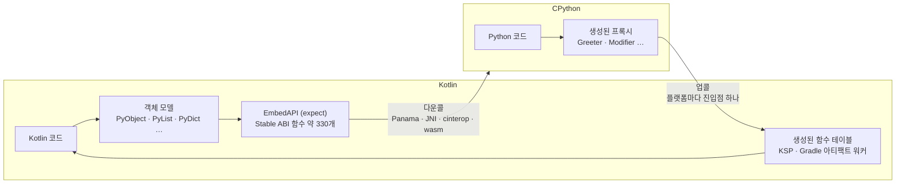

[English](../../README.md) | 한국어

<div align="center">

# 🐍 python-multiplatform

**Kotlin Multiplatform 안의 진짜 CPython — Kotlin 이 Python 을, Python 이 Kotlin 을, 모든 타깃에서 부른다.**

[](../../LICENSE)
[](https://kotlinlang.org/docs/multiplatform.html)
[](https://www.python.org/)
[-lightgrey.svg)](#-플랫폼)

[가이드](https://thisisthepy.github.io/python-multiplatform/) ·
[설계 문서](../design/) ·
[로드맵](../roadmap/ROADMAP.md)

</div>

---

## 💡 왜 필요한가

라이브러리는 Python 에 있고, 닿는 범위는 Kotlin Multiplatform 에 있다 — 데스크톱, Android, iOS, 웹.
python-multiplatform 은 **진짜 CPython 인터프리터**를 Kotlin Multiplatform 앱 안에 넣고, 그 위에
양방향 다리를 놓는다.

- Kotlin 은 Python 위에 **타입이 있는, Kotlin 다운 객체 모델**을 얻는다. `PyList` 는 곧
  `MutableList` 이고, `PyDict` 는 곧 `MutableMap` 이며, Python 오류는 곧 `Throwable` 이다.
- Python 은 **Kotlin 클래스를 평범한 Python 으로** 쓴다. `Greeter('Kotlin').greet(2)`,
  `suspend fun` 에 대한 `await`, 메서드로 보이는 Kotlin 확장 함수 — 모두 빌드 타임에 생성한 테이블을
  거치므로, 리플렉션이 없는 곳(Kotlin/Native, GraalVM 네이티브 이미지)에서도 동작한다.

재구현이 아니라 CPython 그 자체이므로 C 확장도 그대로 동작한다.

## ✨ 기능

- 🔌 **다운콜** — CPython Stable ABI(약 330개 함수)를 `expect` 하나로 선언하고 플랫폼마다 `actual` 을
  둔다. 데스크톱은 Panama `invokeExact`, Android 는 `RegisterNatives` JNI, Native 는 cinterop.
- 🧩 **객체 모델** — `PyObject`, `PyType`, `PyException`, 기본 타입, Kotlin 컬렉션 인터페이스를 구현하는
  `PyList` / `PyDict` / `PySet` / `PyTuple`, 모듈, 호출 가능 객체, 변환 계층.
- 🚀 **업콜** — KSP 프로세서가 함수 테이블을 생성한다. Python 이 Kotlin 클래스를 생성하고, 메서드를
  부르고, 프로퍼티를 읽고 쓰고, `suspend` 함수를 취소까지 포함해 `await` 한다.
- 📦 **빌드된 라이브러리 바인딩** — Gradle 플러그인이 jar(Compose 포함)를 훑어 바인딩과 `.pyi` 스텁을
  생성한다. 기본 인자 생략과 값 클래스를 지원한다.
- ♻️ **수동 메모리 관리 없음** — 래퍼는 수거될 때 Python 참조를 놓는다. 경계를 가로지르는 참조 순환은
  Python 의 순환 GC 가 수거한다.
- 🧪 **측정됨** — 모든 경계 메커니즘에 오버헤드 테스트가 붙어 있고, 비용 표는 실제 실행에서 렌더링된다
  ([비용 표](../investigations/cost-table.md)).

## 🚀 빠른 시작

> **아직 배포되지 않았다.** Maven Central 이나 JitPack 에 릴리스가 없다. 아래처럼 소스에서 빌드한다.
> 릴리스가 나오면 좌표를 공지한다.

```bash
git clone https://github.com/thisisthepy/python-multiplatform
cd python-multiplatform
./gradlew :sample:run          # 데스크톱 데모 앱
```

### Kotlin → Python

```kotlin
import python.multiplatform.ffi.PyObject
import python.multiplatform.ffi.Python3
import python.multiplatform.ffi.types.basic.PyInt
import python.multiplatform.ffi.types.collections.PyList

fun main() {
    Python3.initialize()

    // 진짜 Python int 로 이루어진 진짜 Python list 를 __main__ 에 게시한다.
    val numbers = PyList.fromList(listOf(2L, 3L, 5L, 7L, 11L).map { PyInt.from(it) })
    Python3.import("__main__").setAttr("kotlin_numbers", numbers)

    val globals = Python3.import("__main__").dict
    val result: PyObject = Python3.eval("sum(kotlin_numbers) * 2", 258 /* Py_eval_input */, globals, globals)
    println("${result.Type.name}: $result")   // int: 56

    Python3.exec("print('hello from python')")
    // close() 가 어디에도 없다. 각 래퍼는 수거될 때 자기 참조를 놓는다.
}
```

### Python → Kotlin

`public` Kotlin 선언은 모두 노출된다 (`@PythonInternal` 로 제외).

```kotlin
package org.thisisthepy.python.multiplatform.demo.bindings

class Greeter(subject: String) {
    var subject: String = subject
    var greetings: Long = 0
        private set

    fun greet(times: Long): String { /* ... */ }
    suspend fun greetNow(times: Long): String = greet(times)
}
```

```python
from org.thisisthepy.python.multiplatform.demo.bindings import Greeter

g = Greeter('Kotlin')    # Kotlin 객체를 생성한다
g.greet(2)               # Kotlin 메서드를 부른다
g.subject = 'Python'     # 프로퍼티 setter
g.greetings = 99         # AttributeError: Kotlin setter 가 private 이다

async def main():
    return await g.greetNow(1)   # Kotlin suspend fun 을 await 한다
```

두 예시 모두 [`sample/`](../../sample/) 앱에서 가져왔다. Kotlin 패키지 이름이 그대로 Python 모듈 이름이다.

### 플랫폼별 준비

<details>
<summary><b>데스크톱</b> — <code>PYTHONHOME</code> 에 stdlib 가 있도록 Gradle 플러그인을 적용한다</summary>

```kotlin
plugins {
    kotlin("jvm")
    application
    id("io.github.thisisthepy.python.multiplatform.bindings") version "<version>"
}
```

`stagePythonHome` 이 맞는 CPython 빌드를 내려받아 릴리스의 `SHA256SUMS` 로 검증하고, 기기 전체가 쓰는
캐시에 풀고, `run` 과 `test` 에 `PYTHONHOME` 을 설정한다. 직접 설정한 `PYTHONHOME` 은 건드리지 않는다.
`pythonBindings { stagePythonHome.set(false) }` 로 끌 수 있다. 최종 사용자용으로 패키징한 앱은 여전히
prefix 를 함께 배포하고 `PYTHONHOME` 을 직접 설정해야 한다.
</details>

<details>
<summary><b>Android</b> — <code>PythonBootstrap.initialize</code> 를 호출한다</summary>

```kotlin
import python.multiplatform.env.PythonBootstrap

class MainActivity : ComponentActivity() {
    override fun onCreate(savedInstanceState: Bundle?) {
        super.onCreate(savedInstanceState)
        PythonBootstrap.initialize(this)   // stdlib 를 한 번 풀고 CPython 을 시작한다
    }
}
```

stdlib 는 APK 에 들어 있고, 첫 실행에 앱 전용 저장소로 풀린다 (API 26–36 에서 237–480 ms 측정).
이후에는 스탬프 확인으로 건너뛴다 (4–28 ms). 여러 번 불러도 안전하다.
</details>

## 🧭 구조 한눈에 보기



플랫폼마다 진입점은 하나이고, 그 뒤에서는 **모든 플랫폼이 같은 생성 테이블을 쓴다** — 플랫폼별
Python → Kotlin 바인딩 코드가 없다. 자세한 내용: [설계 문서](../design/).

## 🌍 플랫폼

| 플랫폼 | 다운콜 | 업콜 | 상태 |
|---|---|---|---|
| 데스크톱 JVM (macOS) | Panama FFM | FFM 업콜 스텁 | ✅ 전체 스위트, GraalVM 네이티브 이미지 검증 |
| 데스크톱 JVM (Linux, Windows) | Panama FFM | FFM 업콜 스텁 | 🟡 배선만, 실행한 적 없음 |
| Android | JNI (`RegisterNatives`) | JNI | ✅ 기기 테스트 |
| iOS | cinterop | `@CName` | 🟡 시뮬레이터에서 공통 스위트 |
| Android native | cinterop | `@CName` | 🟡 기기에서 공통 스위트 |
| wasmJs (브라우저, Node) | Emscripten CPython | `@WasmExport` | 🧪 실험적 |

## 📊 상태

정직한 요약이다 — 남은 작업은 [로드맵](../roadmap/ROADMAP.md) 에 있다.

| 영역 | 상태 |
|---|---|
| 인터프리터 수명주기, 객체 모델, 다운콜 표면 | ✅ 구현 |
| 객체 수명과 경계를 넘는 순환 수거 | ✅ 데스크톱 · 🟡 그 외 타깃 |
| 업콜 (클래스, 프로퍼티, `suspend`, 취소) | ✅ 데스크톱 · 🟡 그 외 타깃 |
| 빌드된 jar 바인딩, Python 에서 Compose | ✅ 데스크톱 · ⏳ Android / iOS / wasm |
| Kotlin/Native klib 바인딩 | 🟡 스캐너만 |
| `.pyi` 스텁 생성 | 🟡 부분 |
| free-threaded CPython (3.14t, desktop 한정, `-PpythonFreeThreaded=true` 옵트인) | 🟡 부분 |

## 🧱 생태계

| 저장소 | 역할 |
|---|---|
| **python-multiplatform** | 언어 경계 (이 저장소) |
| [pythonx-compose](https://github.com/thisisthepy/pythonx-compose) | 이 바인더 위에 세운, Compose 를 파이써닉하게 쓰는 패키지 |
| [toolchain](https://github.com/thisisthepy/toolchain) | Python 앱 빌드를 위한 Gradle 어휘 |
| [pypackpack](https://github.com/thisisthepy/pypackpack) | Python 취득, 의존성 해석, 번들링 |
| [torchnative](https://github.com/thisisthepy/torchnative) | 기기 위의 진짜 PyTorch 생태계 |
| [Gemstone](https://github.com/LogitAI/Gemstone) | python-multiplatform 채택을 계획 중인 독립 프로젝트 |

## 📖 문서

- 🌐 **[가이드](https://thisisthepy.github.io/python-multiplatform/)** (English / 한국어) — 소스는 [`docs/guide/`](../guide/)
- 🏗 [설계 문서](../design/) — 구조, 다운콜, 업콜, 수명, 스레딩, 노출 정책
- 📱 [플랫폼 문서](../platforms/) — Android FFM, wasm, CPython 취득, GraalVM 검증
- 🔬 [조사 기록](../investigations/) — 측정과 감사
- 🗺 [로드맵](../roadmap/ROADMAP.md)
- 🇺🇸 [영어 README](../../README.md)

## 🤝 기여

이 프로젝트는 의도 기반 스펙 주도 개발과 테스트 주도 개발로 운영한다. 의도가 스펙의 경계를 정하고,
스펙이 테스트를 이끌며, 테스트는 코드보다 먼저 빨간 상태로 작성한다. 풀 리퀘스트를 열기 전에
[가이드의 기여 절](https://thisisthepy.github.io/python-multiplatform/#contributing) 을 읽어 달라.
iOS 타깃 빌드에는 Xcode 가 있는 macOS 가 필요하다.

## 📄 라이선스

[MIT](../../LICENSE) © 2024 thisisthepy
